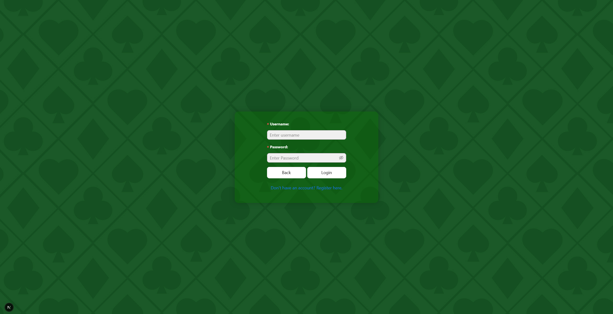
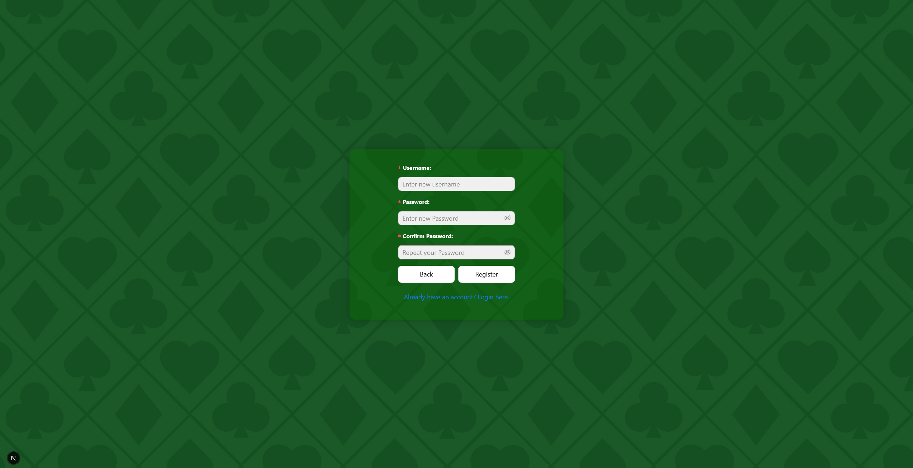
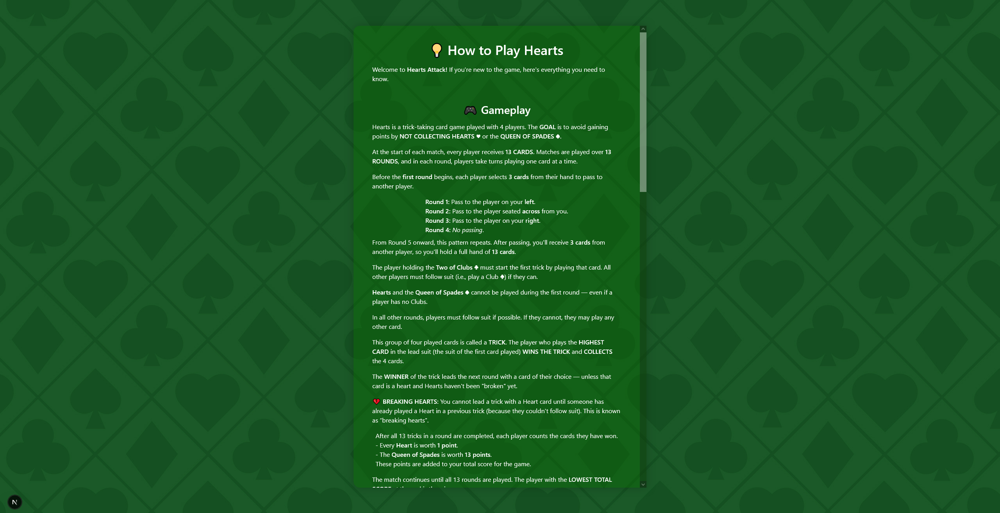
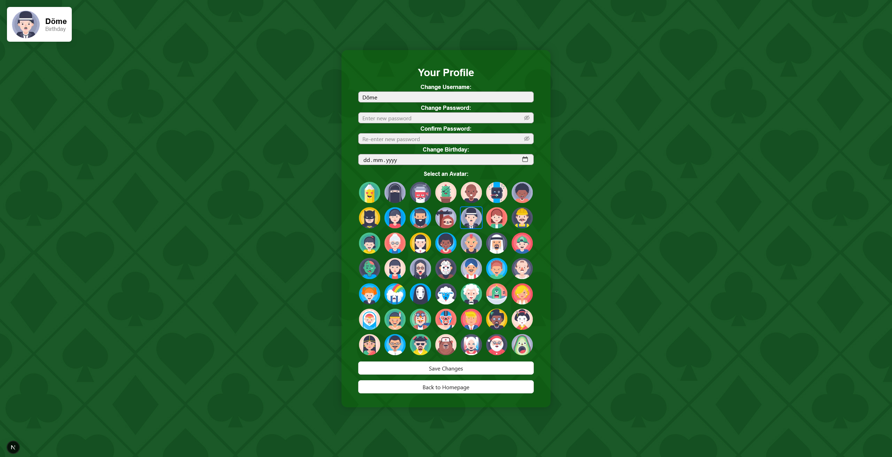
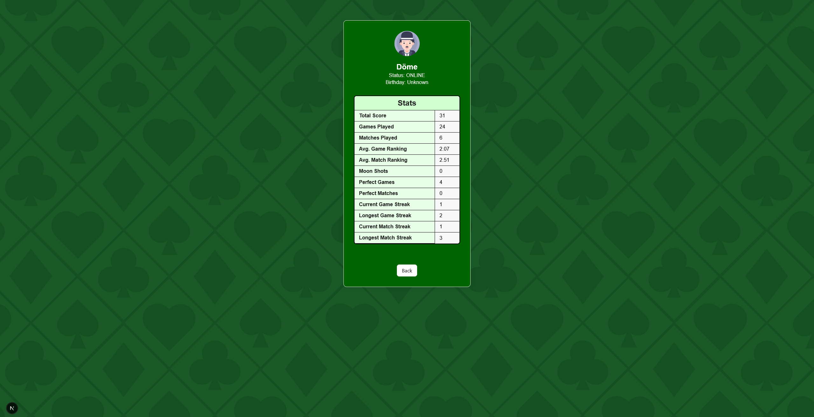
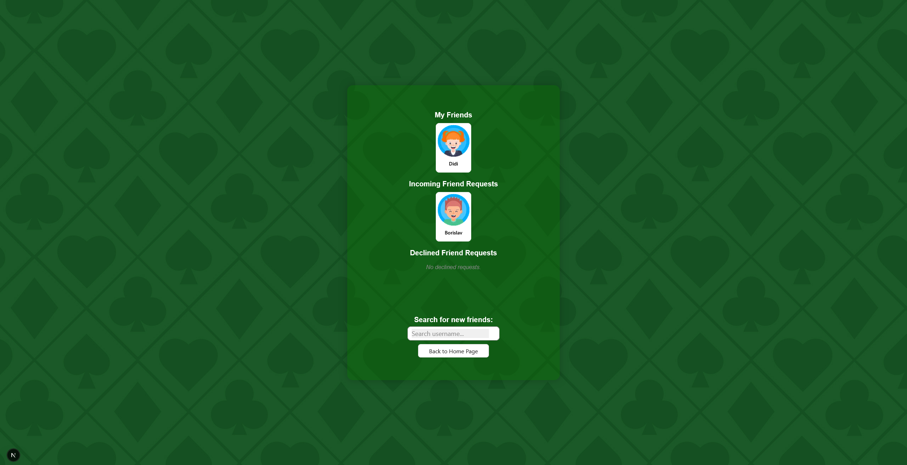
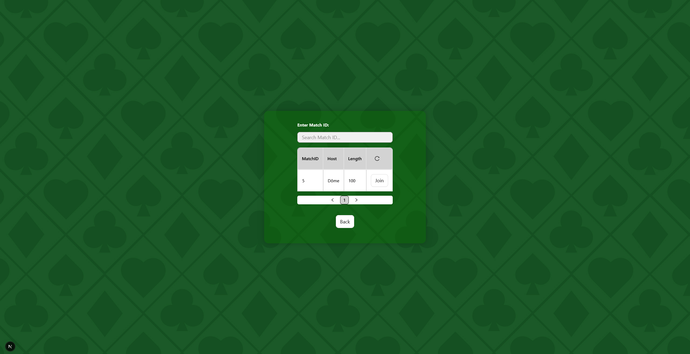
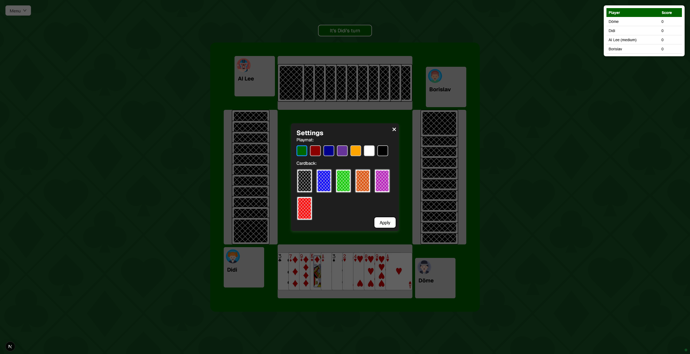
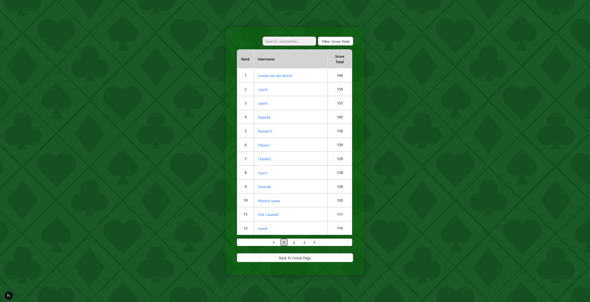

# HEARTS ATTACK!

This project is a web app implementation of the classic card game Hearts.

## Introduction

We are designing an online version of the card game “Hearts”, in which players
can meet online for a match or complete their group with virtual players. Our
aim is to provide players with detailed statistics of previous wins/losses so
they can track their progress and compare their skills with other players.

## Technologies

### Frontend

- [Next.js](https://nextjs.org/) – React-based framework for server-side
  rendering and routing
- [React](https://reactjs.org/) – JavaScript library for building user
  interfaces
- [TypeScript](https://www.typescriptlang.org/) – Superset of JavaScript with
  static typing
- [Ant Design](https://ant.design/) – UI component library for React
- [Spring Boot](https://spring.io/projects/spring-boot) – Backend framework used
  to build the RESTful API
- [Node.js](https://nodejs.org/) – JavaScript runtime environment
- [CSS Modules](https://github.com/css-modules/css-modules) – Scoped and modular
  CSS styling
- [ESLint](https://eslint.org/) – Linter for code quality and formatting
  consistency

### Backend

- [Spring Boot](https://spring.io/projects/spring-boot) – Java-based framework
  for building RESTful APIs
- [Java 17](https://openjdk.org/projects/jdk/17/) – Programming language used
  for backend logic
- [Maven](https://maven.apache.org/) – Dependency and build management for Java
  projects
- [JUnit](https://junit.org/) – Testing framework for Java

## High-Level Components

### 1. **MatchPage Component**

- **File:** [`/app/match/[id]/page.tsx`](./app/match/[id]/page.tsx)
- **Role:** Handles the main game view, including card rendering, trick
  management, score display, and player interactions.
- **Correlation:** Communicates with the backend to fetch and update game state.

### 2. **StartPage Component**

- **File:** [`/app/start/[id]/page.tsx`](./app/start/[id]/page.tsx)
- **Role:** Handles the match setup and invites players. This page allows the
  host to configure the match by selecting players, setting game rules (e.g.,
  point limits), and inviting players (either humans or AI).
- **Correlation:** Communicates with the backend to to manage player
  invitations, configure match settings, and retrieve the match state (e.g.,
  invites, current players). It may also handle AI configuration.

### 3. **Profile Component**

- **File:** [`/app/profile/[id]/page.tsx`](./app/profile/[id]/page.tsx)
- **Role:** Displays and allows the user to edit their profile information such
  as username, avatar, and personal statistics (e.g., games played, win rate).
- **Correlation:** Communicates with the backend to fetch the user's profile
  data and allows for updates.

### 4. **Leaderboard Component**

- **File:** [`/app/leaderboard/page.tsx`](./app/leaderboard/page.tsx)
- **Role:** Displays the leaderboard showing scores and rankings of players in
  the game. It keeps track of each player's progress across different matches.
- **Correlation:** Communicates with the backend to fetch player statistics and
  scores and updates the leaderboard accordingly.

### 5. **Friends Component**

- **File:** [`/app/friends/[id]/page.tsx`](./app/friends/[id]/page.tsx)
- **Role:** Manages the user's friends list, including sending and receiving
  friend requests, viewing accepted friends, and handling pending or declined
  requests.
- **Correlation:** Communicates with the backend to send and receive friend
  requests, display a list of accepted friends, and update the friends list
  based on user actions.

## Launch & Deployment

### Prerequisites

Make sure you have the following installed:

- [Node.js](https://nodejs.org/) (v18 or later)
- [npm](https://www.npmjs.com/) or [yarn](https://yarnpkg.com/)
- [Java 17](https://adoptium.net/en-GB/temurin/releases/)
- [Maven](https://maven.apache.org/)

## Running the Application Locally

### Clone The Repository

```shell
git clone https://github.com/borislav-rakic/sopra-fs25-group-12-server
```

```shell
cd sopra-fs25-group-12-server
```

## Building with Gradle
You can use the local Gradle Wrapper to build the application.
-   macOS: `./gradlew`
-   Linux: `./gradlew`
-   Windows: `./gradlew.bat`

More Information about [Gradle Wrapper](https://docs.gradle.org/current/userguide/gradle_wrapper.html) and [Gradle](https://gradle.org/docs/).

### Build

```bash
./gradlew build
```

### Run

```bash
./gradlew bootRun
```

You can verify that the server is running by visiting `localhost:8080` in your browser.

### Test

```bash
./gradlew test
```

## Illustrations

### 1. Landing Page
The page users land on initially.


### 2. Login
Standard login page.


### 3. Register
Standard registration page.


### 4. Logged in Landing Page
Once a user is logged in, they are brought to this page.


### 5. Rules
An overview of the rules of the game.


### 6. User Profile
Where a player can see the stats of both themselves and other players.


### 7. Personal User Profile
Where a user can change their user profile.


### 8. Friends Page
Where a user can manage their friends list.


### 9. Match Setup
Upon selecting start match, a user is brought to this setup screen.


### 10. Player Invitation
How the host sees the players they can invite.


### 11. Invitation Popup
What a player sees when the host invites them to join their game.


### 12. Join Page
A list of all joinable games.


### 13. Join Popup
The host sees this popup if a player would like to join.


### 14. Match Page
Once a match starts, users see this page. The entire game takes place on this page.


### 15. Middle of Match
During a match, cards are placed in the middle and when it’s the player’s turn, the cards they can play are highlighted.


### 16. Settings
Allows the user to select different colored gameboards and cardbacks.


### 17. Round End
A brief summary of the total points and rounds played so far, as well as information regarding certain events, like a perfect game or moon shot.


### 18. Match End
A total summary of the game, as well as how many points you earned for the global leaderboard.


### 19. Leaderboard
Shows the stats of all users ranked on a leaderboard


## Roadmap

Here are the top 2–3 features that new developers who want to contribute to the
project could add:

- Add some optional background music and sound effects for actions like
  shuffling cards, playing a card, breaking hearts, playing the Queen of Spades
  etc. 🎵
- Add chat feature for users to interact during a match 💬

## Authors & Acknowledgment

SoPra25 Team 12 consists of:

- **Stevania Eilyn Frutiger** -
  [stevaniaeilyn](https://github.com/stevaniaeilyn)
- **Dominique Heller** - [dominiqueheller](https://github.com/dominiqueheller)
- **Borislav Rakic** - [borislav-rakic](https://github.com/borislav-rakic)
- **Dieter Andreas Studer** - [diderot5038](https://github.com/diderot5038)

We would like to extend our sincere gratitude to the external resources that
helped bring this project to life. Our special thanks go to:

- Deck of Cards API – This API provided an efficient and creative way to draw
  cards and utilize their [unique card designs](https://www.deckofcardsapi.com),
  enhancing the visual appeal and functionality of our application.
- IconPacks – We are grateful for the
  [free card back design](https://www.iconpacks.net/free-icon/red-playing-card-back-25479.html)
  available on IconPacks, which added an engaging visual element to the game
  interface.
- Sketch App Sources – Our avatar designs are derived from the creative
  resources offered on
  [Sketch App Sources](https://www.sketchappsources.com/free-source/4830-avatar-characters-sketch-freebie-resource.html).
  We also wish to acknowledge the original author of the avatar artworks,
  [Laura Reen](http://laurareen.com/), a visual artist from Prague, Czech
  Republic.

Their contributions have been instrumental in shaping a visually appealing and
interactive experience, and we are deeply appreciative of their generosity in
providing these free resources.

## License

This project is provided under the [MIT License](LICENSE).
